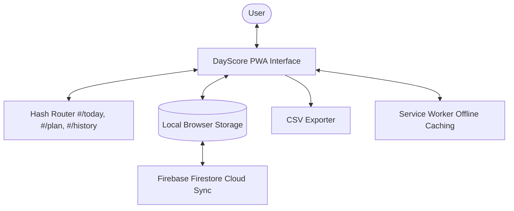

# ☀️ DayScore — Daily Productivity, Planning & Reflection PWA

[](https://developer.mozilla.org/en-US/docs/Web/JavaScript)
[](https://developer.mozilla.org/en-US/docs/Web/Progressive_web_apps)
[](https://firebase.google.com/)
[](LICENSE)

> *"Plan tomorrow. Execute today. Reflect always."*

**DayScore** is an intentional, distraction-free daily productivity and score-tracking web application built to encourage proactive planning rather than reactive scrambling.

Featuring a circular progress ring, priority-based task scheduling, historical day-by-day logs, productivity analytics charts, CSV data export, and an offline-first architecture with optional **Firebase Firestore** cloud synchronization.

---

## 🌟 Key Features

### 1. ☀️ Today View (Execution)
* **Visual Progress Ring**: Live SVG circular progress indicator displaying your daily completion score percentage.
* **Three-State Task Tracking**: Mark tasks as **Done** (100%), **Partial** (50%), or **Skipped** (0%) to reflect real-world progress.
* **Unplanned Task Capture**: Floating Action Button (`+`) to quickly jot down unexpected tasks without breaking flow.

### 2. 📋 Plan Tomorrow View (Intentionality)
* **Night-Before Planning**: Enter tasks for the upcoming day to wake up with clarity and direction.
* **Metadata & Categorization**: Set categories (e.g. Work, Study, Health), estimated time in minutes, and priority levels (**High**, **Med**, **Low**).

### 3. 📅 History View (Reflection)
* **Interactive Date Picker**: Navigate through previous days with `<` and `>` controls or calendar selection.
* **Day-by-Day Score Card**: Review past execution scores and inspect which tasks were completed or missed.

### 4. 📊 Insights & Analytics
* **Performance Overview**: Track **Average Score**, **Total Tasks**, **Done Rate**, and **Active Streak Days**.
* **Period Aggregations**: Switch between Daily, Weekly, and Monthly aggregations.
* **Visual Charts**: 7-day score trends and category time/task breakdowns.

### 5. ⬇️ Data Export & Privacy
* **CSV Export**: Download your productivity history across custom date ranges for analysis in Excel, Google Sheets, or AI tools.
* **Offline-First Storage**: Data is saved locally in browser `localStorage` with optional seamless cloud sync to Firebase.

---

## 🏗️ Architecture & Data Flow



---

## 📁 Repository Structure

```text
DayScore/
├── index.html        # Main app shell, views, and modal overlays
├── manifest.json     # PWA manifest for standalone mobile/desktop install
├── sw.js             # Service worker for offline asset caching
├── css/
│   └── styles.css    # Inter font, dark theme palette (#0f1117), responsive layout
├── js/
│   ├── app.js        # Core state machine, DOM rendering, and hash routing
│   ├── storage.js    # LocalStorage abstraction & data persistence
│   ├── firebase-sync.js # Optional Firebase Firestore cloud synchronization
│   └── export.js     # Date-range CSV generation and download trigger
└── icons/            # App icons for iOS and Android
```

---

## 🚀 Quick Start Guide (For Beginners)

No complex build steps or dependencies required!

### 1. Clone the Repository
```bash
git clone https://github.com/kaustubh12022/DayScore.git
cd DayScore
```

### 2. Run Locally
Open `index.html` directly in your browser, or launch a quick local server:

**Using Python:**
```bash
python -m http.server 3000
```
Open **`http://localhost:3000`** in your browser to start tracking your daily scores!

### 3. Optional: Configure Firebase Cloud Sync
If you wish to sync data across devices:
1. Create a project at [Firebase Console](https://console.firebase.google.com/).
2. Enable **Firestore Database** and **Anonymous Authentication**.
3. Add your Firebase configuration keys in `js/firebase-sync.js`.

---

## 📱 Installing as a PWA
* **On Chrome / Edge (Desktop)**: Click the install icon in the address bar to install DayScore as a desktop app.
* **On Safari (iOS)**: Tap the Share button $\rightarrow$ **"Add to Home Screen"**.
* **On Chrome (Android)**: Tap the menu $\rightarrow$ **"Install app"**.

---

## 📄 License

This project is licensed under the **MIT License**.
